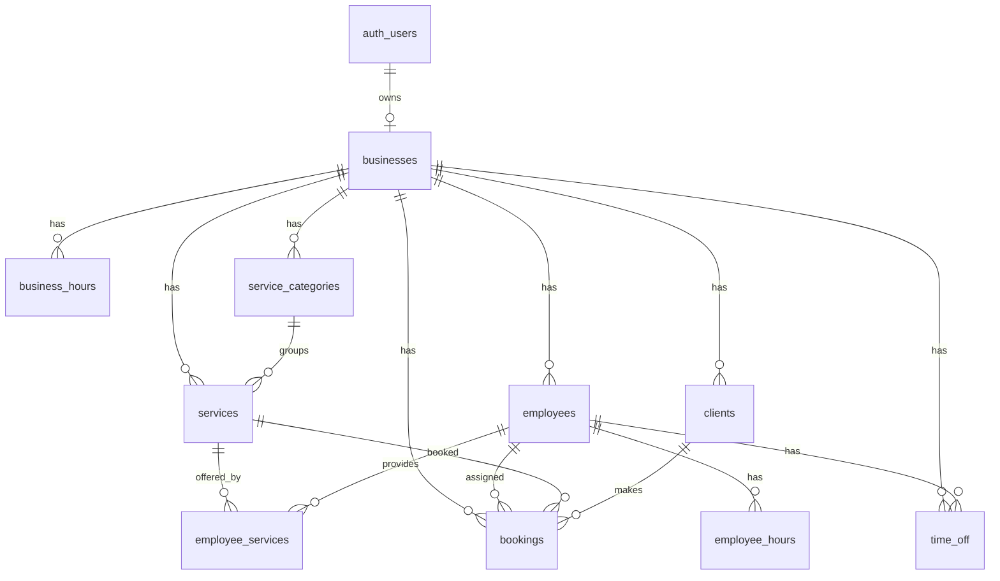

# Slotify — Dizajn baze podataka (DB.md)

> Verzija: 1.0 (MVP)
> Baza: PostgreSQL (Supabase)
> Prati: `PRD.md`, `Tech.md`

---

## 1. Principi dizajna

- Multi-tenant kroz kolonu **`business_id`** na svim resursima.
- **Row Level Security (RLS)** uključen na svim tenant tabelama (deny-by-default).
- Vremena se čuvaju kao `timestamptz` (UTC u bazi); prikaz u timezone biznisa.
- Zaštita od duplih rezervacija: **exclusion constraint** uz `btree_gist`.
- Mekani identitet vlasnika: `business.owner_id -> auth.users.id`.

### Potrebne ekstenzije
```sql
create extension if not exists "pgcrypto";   -- gen_random_uuid()
create extension if not exists "btree_gist";  -- exclusion constraint nad employee_id + range
```

---

## 2. ER dijagram



---

## 3. Enumi

```sql
create type booking_status as enum (
  'pending', 'confirmed', 'cancelled', 'completed', 'no_show'
);

create type confirmation_mode as enum ('auto', 'manual');

create type time_off_scope as enum ('business', 'employee');

create type time_off_type as enum ('holiday', 'block', 'break');

-- 0 = nedjelja ... 6 = subota (uskladiti sa app slojem)
-- weekday se čuva kao smallint (0-6), ne enum, radi lakših upita
```

---

## 4. Tabele

### 4.1 `businesses`
Glavni tenant zapis.

| Kolona | Tip | Ograničenja / Default | Opis |
|--------|-----|------------------------|------|
| id | uuid | PK, default `gen_random_uuid()` | |
| owner_id | uuid | NOT NULL, FK -> auth.users(id) | Vlasnik |
| name | text | NOT NULL | Naziv biznisa |
| slug | text | NOT NULL, UNIQUE | URL `/{slug}` |
| description | text | | Opis za javnu stranicu |
| timezone | text | NOT NULL, default `'UTC'` | IANA tz (npr. `Europe/Sarajevo`) |
| currency | text | NOT NULL, default `'USD'` | ISO 4217 |
| logo_url | text | | Branding |
| brand_color | text | default `'#0ea5e9'` | Branding |
| confirmation_mode | confirmation_mode | NOT NULL, default `'auto'` | Auto/ručna potvrda |
| min_lead_minutes | int | NOT NULL, default `120` | Min. najava unaprijed |
| max_horizon_days | int | NOT NULL, default `60` | Max. horizont booking-a |
| cancel_cutoff_hours | int | NOT NULL, default `24` | Rok za otkaz/izmjenu od strane klijenta |
| allow_any_employee | boolean | NOT NULL, default `true` | Dozvoli "bilo koji dostupni" |
| created_at | timestamptz | default `now()` | |

Indeksi: `unique(slug)`, `index(owner_id)`.

---

### 4.2 `service_categories`
Grupisanje usluga (npr. "Hair", "Nails").

| Kolona | Tip | Ograničenja | Opis |
|--------|-----|-------------|------|
| id | uuid | PK | |
| business_id | uuid | NOT NULL, FK -> businesses(id) ON DELETE CASCADE | |
| name | text | NOT NULL | |
| sort_order | int | default `0` | Redoslijed prikaza |

Indeks: `index(business_id)`.

---

### 4.3 `services`

| Kolona | Tip | Ograničenja | Opis |
|--------|-----|-------------|------|
| id | uuid | PK | |
| business_id | uuid | NOT NULL, FK -> businesses(id) ON DELETE CASCADE | |
| category_id | uuid | NULL, FK -> service_categories(id) ON DELETE SET NULL | |
| name | text | NOT NULL | |
| description | text | | |
| duration_minutes | int | NOT NULL, CHECK > 0 | Default trajanje |
| buffer_minutes | int | NOT NULL, default `0`, CHECK >= 0 | Buffer poslije termina |
| price | numeric(10,2) | NOT NULL, CHECK >= 0 | Default cijena |
| is_active | boolean | NOT NULL, default `true` | Vidljivost na javnoj stranici |
| created_at | timestamptz | default `now()` | |

Indeksi: `index(business_id)`, `index(category_id)`.

---

### 4.4 `employees`

| Kolona | Tip | Ograničenja | Opis |
|--------|-----|-------------|------|
| id | uuid | PK | |
| business_id | uuid | NOT NULL, FK -> businesses(id) ON DELETE CASCADE | |
| full_name | text | NOT NULL | |
| email | text | | Opciono (za budući login) |
| avatar_url | text | | |
| is_active | boolean | NOT NULL, default `true` | |
| created_at | timestamptz | default `now()` | |

Indeks: `index(business_id)`.

---

### 4.5 `employee_services`
Veza M:N + override cijene/trajanja po zaposlenom.

| Kolona | Tip | Ograničenja | Opis |
|--------|-----|-------------|------|
| id | uuid | PK | |
| business_id | uuid | NOT NULL, FK -> businesses(id) ON DELETE CASCADE | Denormalizovano radi RLS |
| employee_id | uuid | NOT NULL, FK -> employees(id) ON DELETE CASCADE | |
| service_id | uuid | NOT NULL, FK -> services(id) ON DELETE CASCADE | |
| price_override | numeric(10,2) | NULL, CHECK >= 0 | Ako NULL → koristi services.price |
| duration_override_minutes | int | NULL, CHECK > 0 | Ako NULL → koristi services.duration_minutes |

Ograničenja: `UNIQUE(employee_id, service_id)`.
Indeksi: `index(business_id)`, `index(service_id)`, `index(employee_id)`.

---

### 4.6 `business_hours`
Default radno vrijeme biznisa po danu u sedmici.

| Kolona | Tip | Ograničenja | Opis |
|--------|-----|-------------|------|
| id | uuid | PK | |
| business_id | uuid | NOT NULL, FK -> businesses(id) ON DELETE CASCADE | |
| weekday | smallint | NOT NULL, CHECK 0..6 | 0=nedjelja |
| open_time | time | NOT NULL | |
| close_time | time | NOT NULL, CHECK close_time > open_time | |
| is_closed | boolean | NOT NULL, default `false` | Zatvoreno taj dan |

Ograničenja: `UNIQUE(business_id, weekday)` (jedan red po danu; više intervala se rješava posebnom tabelom ako zatreba).

---

### 4.7 `employee_hours`
Override radnog vremena po zaposlenom (ako ne postoji red → nasljeđuje `business_hours`).

| Kolona | Tip | Ograničenja | Opis |
|--------|-----|-------------|------|
| id | uuid | PK | |
| business_id | uuid | NOT NULL, FK -> businesses(id) ON DELETE CASCADE | |
| employee_id | uuid | NOT NULL, FK -> employees(id) ON DELETE CASCADE | |
| weekday | smallint | NOT NULL, CHECK 0..6 | |
| open_time | time | NOT NULL | |
| close_time | time | NOT NULL, CHECK close_time > open_time | |
| is_closed | boolean | NOT NULL, default `false` | |

Ograničenja: `UNIQUE(employee_id, weekday)`.
Indeks: `index(business_id)`.

---

### 4.8 `time_off`
Pauze, blokovi i praznici (neradni periodi). Scope određuje da li važi za cijeli biznis ili jednog zaposlenog.

| Kolona | Tip | Ograničenja | Opis |
|--------|-----|-------------|------|
| id | uuid | PK | |
| business_id | uuid | NOT NULL, FK -> businesses(id) ON DELETE CASCADE | |
| employee_id | uuid | NULL, FK -> employees(id) ON DELETE CASCADE | NULL → važi za cijeli biznis |
| scope | time_off_scope | NOT NULL | 'business' ili 'employee' |
| type | time_off_type | NOT NULL | 'holiday' / 'block' / 'break' |
| starts_at | timestamptz | NOT NULL | |
| ends_at | timestamptz | NOT NULL, CHECK ends_at > starts_at | |
| reason | text | | |

Indeksi: `index(business_id)`, `index(employee_id)`, `index using gist (tstzrange(starts_at, ends_at))`.

---

### 4.9 `clients`
CRM-lite; auto-grupisanje unutar biznisa po email/telefon.

| Kolona | Tip | Ograničenja | Opis |
|--------|-----|-------------|------|
| id | uuid | PK | |
| business_id | uuid | NOT NULL, FK -> businesses(id) ON DELETE CASCADE | |
| full_name | text | NOT NULL | |
| email | text | | |
| phone | text | | |
| notes | text | | Bilješke vlasnika |
| created_at | timestamptz | default `now()` | |

Ograničenja (auto-grupisanje):
- `UNIQUE(business_id, email)` (partial: `WHERE email IS NOT NULL`)
- `UNIQUE(business_id, phone)` (partial: `WHERE phone IS NOT NULL`)

Indeks: `index(business_id)`.

---

### 4.10 `bookings`
Centralna tabela rezervacija.

| Kolona | Tip | Ograničenja | Opis |
|--------|-----|-------------|------|
| id | uuid | PK | |
| business_id | uuid | NOT NULL, FK -> businesses(id) ON DELETE CASCADE | |
| employee_id | uuid | NOT NULL, FK -> employees(id) ON DELETE RESTRICT | |
| service_id | uuid | NOT NULL, FK -> services(id) ON DELETE RESTRICT | |
| client_id | uuid | NOT NULL, FK -> clients(id) ON DELETE RESTRICT | |
| status | booking_status | NOT NULL, default `'pending'` | |
| starts_at | timestamptz | NOT NULL | Početak |
| ends_at | timestamptz | NOT NULL, CHECK ends_at > starts_at | Kraj (uklj. trajanje, bez buffera) |
| buffer_minutes | int | NOT NULL, default `0` | Snapshot buffera |
| price | numeric(10,2) | NOT NULL | Snapshot cijene u trenutku rezervacije |
| manage_token | text | NOT NULL, UNIQUE | Neprozirni token za gosta |
| source | text | NOT NULL, default `'online'` | 'online' / 'manual' |
| reminder_sent_at | timestamptz | NULL | Označava poslan podsjetnik |
| created_at | timestamptz | default `now()` | |
| updated_at | timestamptz | default `now()` | |

#### Ključno ograničenje: zaštita od preklapanja
Sprečava dvije aktivne rezervacije istog zaposlenog u preklapajućem terminu:

```sql
alter table bookings add constraint no_overlap_per_employee
exclude using gist (
  employee_id with =,
  tstzrange(starts_at, ends_at, '[)') with &&
) where (status in ('pending', 'confirmed'));
```

Indeksi:
- `index(business_id)`
- `index(employee_id, starts_at)`
- `index(business_id, starts_at)` (dashboard/kalendar upiti)
- `index(status)`
- `unique(manage_token)`

---

## 5. Pomoćne funkcije (RLS helper)

```sql
-- Da li trenutni korisnik posjeduje dati biznis
create or replace function public.owns_business(b_id uuid)
returns boolean
language sql
security definer
stable
as $$
  select exists (
    select 1 from businesses
    where id = b_id and owner_id = auth.uid()
  );
$$;
```

---

## 6. Row Level Security (RLS)

RLS se uključuje na svim tabelama; podrazumijevano sve je zabranjeno dok politika ne dozvoli.

```sql
alter table businesses          enable row level security;
alter table service_categories  enable row level security;
alter table services            enable row level security;
alter table employees           enable row level security;
alter table employee_services   enable row level security;
alter table business_hours      enable row level security;
alter table employee_hours      enable row level security;
alter table time_off            enable row level security;
alter table clients             enable row level security;
alter table bookings            enable row level security;
```

### 6.1 Vlasnik (pun pristup svom biznisu)
Primjer za `businesses` i obrazac za ostale tenant tabele:

```sql
-- businesses: vlasnik vidi i mijenja samo svoj biznis
create policy owner_select_business on businesses
  for select using (owner_id = auth.uid());
create policy owner_update_business on businesses
  for update using (owner_id = auth.uid());
create policy owner_insert_business on businesses
  for insert with check (owner_id = auth.uid());

-- Obrazac za tenant tabele (npr. services); isto za sve sa business_id
create policy owner_all_services on services
  for all
  using (owns_business(business_id))
  with check (owns_business(business_id));
```

> Isti `owner_all_*` obrazac se primjenjuje na: service_categories, employees,
> employee_services, business_hours, employee_hours, time_off, clients, bookings.

### 6.2 Javni (gost) pristup — read-only javnih podataka
Gost (anon) sme čitati samo aktivne, javne resurse:

```sql
-- Javno čitanje biznisa (za /{slug})
create policy public_read_business on businesses
  for select using (true);

-- Javno čitanje aktivnih usluga
create policy public_read_active_services on services
  for select using (is_active = true);

-- Javno čitanje aktivnih zaposlenih
create policy public_read_active_employees on employees
  for select using (is_active = true);

-- Javno čitanje employee_services, business_hours, employee_hours, time_off
-- (potrebno za izračun dostupnosti na javnoj stranici)
create policy public_read_employee_services on employee_services for select using (true);
create policy public_read_business_hours on business_hours for select using (true);
create policy public_read_employee_hours on employee_hours for select using (true);
create policy public_read_time_off on time_off for select using (true);
```

> Napomena: `clients` i `bookings` NEMAJU javnu select politiku. Gost nikad ne lista
> tuđe rezervacije ni klijente. Pristup pojedinačnoj rezervaciji ide preko servera uz `manage_token`.

### 6.3 Kreiranje rezervacije i pristup preko tokena
- Insert rezervacije gosta ide kroz **`security definer` RPC** (`create_booking`), pozvanu sa servera. RPC interno radi validaciju i upis (zaobilazi potrebu za insert politikom za anon).
- Čitanje/izmjena rezervacije gosta radi se server-side: server traži red po `manage_token` (preko service-role ili posebne `security definer` funkcije) i tek tada izlaže podatke.

---

## 7. RPC: `create_booking` (transakcioni upis)

Skica (potpuna implementacija u migracijama):

```sql
create or replace function public.create_booking(
  p_business_id uuid,
  p_employee_id uuid,
  p_service_id uuid,
  p_starts_at timestamptz,
  p_client_name text,
  p_client_email text,
  p_client_phone text
) returns bookings
language plpgsql
security definer
as $$
declare
  v_service services%rowtype;
  v_es employee_services%rowtype;
  v_duration int;
  v_buffer int;
  v_price numeric(10,2);
  v_ends timestamptz;
  v_client_id uuid;
  v_booking bookings%rowtype;
  v_mode confirmation_mode;
begin
  select * into v_service from services where id = p_service_id and business_id = p_business_id;
  if not found then raise exception 'Service not found'; end if;

  select * into v_es from employee_services
    where employee_id = p_employee_id and service_id = p_service_id;
  if not found then raise exception 'Employee does not offer service'; end if;

  v_duration := coalesce(v_es.duration_override_minutes, v_service.duration_minutes);
  v_buffer   := v_service.buffer_minutes;
  v_price    := coalesce(v_es.price_override, v_service.price);
  v_ends     := p_starts_at + make_interval(mins => v_duration);

  -- TODO: validacija radnog vremena, pauza, blokova, praznika, lead time
  -- (može i u app sloju; exclusion constraint pokriva preklapanja)

  -- upsert klijenta (auto-grupisanje po email/phone unutar biznisa)
  insert into clients (business_id, full_name, email, phone)
  values (p_business_id, p_client_name, nullif(p_client_email,''), nullif(p_client_phone,''))
  on conflict (business_id, email) where email is not null
  do update set full_name = excluded.full_name
  returning id into v_client_id;

  select confirmation_mode into v_mode from businesses where id = p_business_id;

  insert into bookings (
    business_id, employee_id, service_id, client_id, status,
    starts_at, ends_at, buffer_minutes, price,
    manage_token, source
  ) values (
    p_business_id, p_employee_id, p_service_id, v_client_id,
    case when v_mode = 'auto' then 'confirmed'::booking_status else 'pending'::booking_status end,
    p_starts_at, v_ends, v_buffer, v_price,
    encode(gen_random_bytes(24), 'base64'), 'online'
  )
  returning * into v_booking;
  -- Ako exclusion constraint padne → exception → transakcija rollback → 409 u app sloju

  return v_booking;
end;
$$;
```

---

## 8. Sigurnosne mjere (sažetak)

- RLS uključen i deny-by-default na svim tenant tabelama.
- `clients` i `bookings` bez javnog `select`-a; pristup gosta samo preko `manage_token` server-side.
- Service-role ključ samo na serveru (vidi `Tech.md`).
- Snapshot cijene i buffera u `bookings` (istorijska tačnost).
- Exclusion constraint kao tvrda garancija protiv duplih rezervacija.
- `security definer` funkcije imaju eksplicitno postavljen `search_path` (sigurnosna praksa).

---

## 9. Pretpostavke (MVP, lako izmjenjivo)

- Jedan red radnog vremena po danu (bez split smjena); split smjene → dodatna tabela intervala.
- Kapacitet termina = 1 (bez grupnih termina).
- Bez super-admin / multi-owner po biznisu (postoji prostor preko buduće `business_members`).
- Valuta default USD, podesivo po biznisu.
