# Slotify — Plan izrade po fazama (Faze.md)

> Verzija: 1.0 (MVP)
> Prati: `PRD.md`, `Tech.md`, `DB.md`
> Cilj MVP-a: kompletan tok biznis setup → javni booking → dashboard.

Plan je razložen na 8 faza. Svaka faza ima jasan cilj, zadatke i kriterij "gotovo".
Redoslijed prati realnu zavisnost: temelj → podaci → logika → javni tok → upravljanje → poliranje.

---

## Faza 0 — Postavka projekta i temelji
**Cilj:** prazan, ali funkcionalan skelet aplikacije sa povezanim servisima.

Zadaci:
- Inicijalizacija Next.js (App Router, TypeScript).
- Tailwind + shadcn/ui setup.
- Supabase projekat + povezivanje (`@supabase/ssr`, anon/server/service-role klijenti).
- Env varijable (vidi `Tech.md` tabelu).
- Vercel projekat + auto-deploy iz repoa.
- Osnovni layout, tema, brand boje.

Gotovo kada: aplikacija se deploya na Vercel i čita iz Supabase test tabele.

---

## Faza 1 — Baza i sigurnost (šema + RLS)
**Cilj:** kompletna šema iz `DB.md` u bazi, sa uključenim RLS-om.

Zadaci:
- Ekstenzije (`pgcrypto`, `btree_gist`).
- Enumi i sve tabele (businesses → bookings).
- Indeksi i ograničenja, uključujući **exclusion constraint** na `bookings`.
- RLS politike (owner + javni read), `owns_business()` helper.
- RPC `create_booking` (skelet sa transakcijom i exclusion zaštitom).
- Migracije u `supabase/migrations`.

Gotovo kada: RLS test prolazi (biznis A ne vidi podatke biznisa B); ručni insert dupliranog termina pada na constraint.

---

## Faza 2 — Autentifikacija i onboarding biznisa
**Cilj:** vlasnik se registruje, prijavljuje i kreira biznis.

Zadaci:
- Supabase Auth (email + lozinka): register, login, logout.
- `middleware.ts` zaštita `(dashboard)` ruta.
- Setup wizard: podaci biznisa (naziv, slug, timezone, valuta, logo, boja).
- Kreiranje `business` zapisa vezanog za `owner_id`.

Gotovo kada: novi korisnik prolazi od registracije do praznog dashboarda sa kreiranim biznisom.

---

## Faza 3 — Upravljanje uslugama, zaposlenima i rasporedom
**Cilj:** vlasnik unosi sve podatke potrebne za izračun dostupnosti.

Zadaci:
- CRUD usluga (+ kategorije, cijena, trajanje, buffer).
- CRUD zaposlenih.
- Dodjela usluga zaposlenima (`employee_services`) + override cijene/trajanja.
- Radno vrijeme: default biznisa (`business_hours`) + override po zaposlenom (`employee_hours`).
- `time_off`: praznici, blokovi, pauze (nivo biznisa i zaposlenog).
- Postavke biznisa: confirmation_mode, lead time, cancel cutoff, allow_any_employee.

Gotovo kada: vlasnik može potpuno konfigurisati biznis spreman za primanje rezervacija.

---

## Faza 4 — Availability engine (srce sistema)
**Cilj:** tačno izračunavanje slobodnih termina.

Zadaci:
- Server-side funkcija `free_slots(business, employee, service, date)` (vidi `Tech.md`).
- Nasljeđivanje radnog vremena (employee override → business default).
- Oduzimanje pauza, blokova, praznika, postojećih rezervacija.
- Primjena trajanja+buffer i lead time pravila.
- Timezone-aware izračun (timezone biznisa).
- Unit testovi za rubne slučajeve.

Gotovo kada: za zadati dan vraća tačnu listu slotova; unit testovi prolaze.

---

## Faza 5 — Javna booking stranica i kreiranje rezervacije
**Cilj:** klijent (bez naloga) rezerviše termin, mobilno-prvo.

Zadaci:
- Javna stranica `/{slug}` (SSR): branding, usluge po kategorijama, cijene.
- Booking flow: usluga → zaposleni (ili "bilo koji") → datum → slot → kontakt.
- Poziv RPC `create_booking` (transakcija + auto-grupisanje klijenta).
- Obrada konflikta (409 "termin upravo zauzet").
- Potvrda na ekranu + Resend email sa `manage_token` linkom.
- `pending` vs `confirmed` ponašanje zavisno od `confirmation_mode`.

Gotovo kada: klijent uspješno rezerviše, dobije ekran i email; konkurentni test daje tačno jednu uspješnu rezervaciju.

---

## Faza 6 — Upravljanje rezervacijom (klijent) i dashboard (vlasnik)
**Cilj:** obje strane upravljaju terminima.

Zadaci (klijent):
- `/manage/{token}`: prikaz rezervacije, otkazivanje i pomjeranje (uz cancel cutoff pravilo).
- Email potvrde izmjena.

Zadaci (vlasnik):
- Kalendar (dan/sedmica) + lista rezervacija.
- Akcije: potvrdi, pomjeri, otkaži, završi, no-show.
- Ručno dodavanje rezervacije (walk-in/telefon).
- Pregled klijenata (CRM-lite) + osnovni podaci i historija.
- Dashboard: danas + ova sedmica, po zaposlenom, brojači po statusu, broj klijenata.

Gotovo kada: vlasnik upravlja svim terminima; klijent upravlja svojim preko linka.

---

## Faza 7 — Notifikacije i pozadinski poslovi
**Cilj:** automatski email tok.

Zadaci:
- Resend šabloni: potvrda, izmjena, otkazivanje, (opciono) obavještenje vlasniku.
- Vercel Cron `/api/cron/reminders`: podsjetnik 24h prije (`reminder_sent_at`).
- Zaštita cron endpointa (`CRON_SECRET`).

Gotovo kada: podsjetnici se šalju tačno jednom; svi tranzicioni emailovi rade.

---

## Faza 8 — Poliranje, sigurnost i lansiranje
**Cilj:** stabilan, siguran MVP spreman za produkciju.

Zadaci:
- RLS revizija i test izolacije A/B biznisa.
- Rate-limiting na booking i manage endpointima.
- `zod` validacija svih ulaza, error/empty/loading stanja.
- Responsivnost (mobile-first klijent, desktop vlasnik), pristupačnost.
- Osnovni E2E test glavnog toka (opciono).
- Production env, finalni deploy, smoke test.

Gotovo kada: ispunjeni svi kriteriji iz `PRD.md` sekcije 10 (Definition of Done).

---

## Pregled zavisnosti faza

```mermaid
flowchart LR
    F0[Faza 0: Setup] --> F1[Faza 1: Baza + RLS]
    F1 --> F2[Faza 2: Auth + Onboarding]
    F2 --> F3[Faza 3: Usluge/Zaposleni/Raspored]
    F3 --> F4[Faza 4: Availability engine]
    F4 --> F5[Faza 5: Javni booking]
    F5 --> F6[Faza 6: Upravljanje + Dashboard]
    F6 --> F7[Faza 7: Notifikacije/Cron]
    F7 --> F8[Faza 8: Poliranje + Lansiranje]
```

---

## Preporučeni redoslijed isporuke (milestones)

- **M1 (temelj):** Faze 0–2 → vlasnik ima nalog i biznis.
- **M2 (konfiguracija + logika):** Faze 3–4 → biznis je spreman, dostupnost radi.
- **M3 (živi booking):** Faza 5 → klijenti mogu rezervisati.
- **M4 (upravljanje):** Faza 6 → pun operativni tok.
- **M5 (produkcija):** Faze 7–8 → notifikacije i lansiranje.
