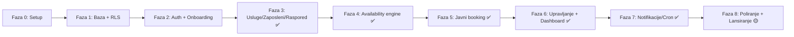

# Slotify — Plan izrade po fazama (Faze.md)

> Verzija: 1.0 (MVP)
> Prati: `PRD.md`, `Tech.md`, `DB.md`
> Cilj MVP-a: kompletan tok biznis setup → javni booking → dashboard.

Plan je razložen na 8 faza. Svaka faza ima jasan cilj, zadatke i kriterij "gotovo".
Redoslijed prati realnu zavisnost: temelj → podaci → logika → javni tok → upravljanje → poliranje.

**Pravilo:** ovaj fajl se ažurira nakon svakog završenog taska (oznaka `[x]`, status faze, zapisnik isporuke).

---

## Pregled napretka

| Faza | Naziv | Status | Napomena |
|------|-------|--------|----------|
| 0 | Postavka projekta | 🟡 Djelimično | UI + Supabase lokalno; Vercel deploy pending |
| 1 | Baza + RLS | ✅ Gotovo | Šema `book_*`, RLS test i exclusion test prolaze |
| 2 | Auth + onboarding | ✅ Gotovo | Email+lozinka, setup wizard, dashboard shell |
| 3 | Usluge / zaposleni / raspored | ✅ Gotovo | 3a–3e kompletno |
| 4 | Availability engine | ✅ Gotovo | `getFreeSlots`, unit testovi |
| 5 | Javni booking | ✅ Gotovo | `/{slug}`, wizard, RPC, Resend email |
| 6 | Dashboard + upravljanje | ✅ Gotovo | Kalendar, CRM, manage link, statistika |
| 7 | Notifikacije / cron | ✅ Gotovo | Email šabloni, cron podsjetnici, CRON_SECRET |
| 8 | Poliranje + lansiranje | 🟡 Djelimično | Rate limit, UX polish; deploy pending |

**Legenda:** ✅ Gotovo · 🟡 U toku / djelimično · ⬜ Nije započeto

**Shared Supabase:** tabele Slotify koriste prefiks `book_` (npr. `book_businesses`) radi odvajanja od CRM tablica u istom projektu.

---

## Zapisnik isporuke

| Datum | Faza / task | Šta je urađeno |
|-------|-------------|----------------|
| 2026-06-23 | F0 · Next.js + UI | Next.js 15 (App Router, TS), Tailwind v4, shadcn/ui inicijalizovan |
| 2026-06-23 | F0 · Paketi | `@supabase/supabase-js`, `@supabase/ssr`, `zod`, `react-hook-form`, `date-fns`, `@tanstack/react-query`, `resend`, … |
| 2026-06-23 | F0 · Supabase klijenti | `utils/supabase/server`, `client`, `middleware`, `admin`; root `middleware.ts` |
| 2026-06-23 | F0 · Env | `.env.local`, `.env.example` (`NEXT_PUBLIC_SUPABASE_PUBLISHABLE_KEY`) |
| 2026-06-23 | F1 · Migracije | 4 migracije u `supabase/migrations/` + primjena na Supabase (`book_*` šema) |
| 2026-06-23 | F1 · RLS + RPC | RLS na svih 10 tabela; `book_owns_business()`, `book_create_booking()` |
| 2026-06-23 | F1 · Verifikacija | `supabase/tests/phase1_verification.sql` — RLS A/B + exclusion constraint PASS |
| 2026-06-23 | F0 · Brand UI | Svijetla sky tema, homepage shell, status kartica Supabase |
| 2026-06-23 | F2 · Auth | `/login`, `/register`, server actions (sign in/up/out), bez email verifikacije |
| 2026-06-23 | F2 · Middleware | Zaštita `/dashboard` i `/setup`; redirect autentifikovanih sa auth ruta |
| 2026-06-23 | F2 · Onboarding | `/setup` wizard (naziv, slug, timezone, valuta, brand boja) → `book_businesses` |
| 2026-06-23 | F2 · Dashboard | Prazan `/dashboard` shell sa sign out i sljedećim koracima (Faza 3) |
| 2026-06-24 | F3a · Nav + usluge | Sidebar (Dashboard, Services, Staff, Schedule, Settings); seed `book_business_hours` Pon–Pet 9–17; CRUD kategorija i usluga na `/services` |
| 2026-06-24 | F3b · Staff | CRUD zaposlenih na `/employees`; dodjela usluga sa override cijene/trajanja (`book_employee_services`) |
| 2026-06-24 | F3c · Schedule | Editor radnog vremena biznisa + override po zaposlenom na `/schedule` |
| 2026-06-24 | F3d · Time off | CRUD praznika/blokova/pauza (`book_time_off`) — business-wide i staff-specific |
| 2026-06-24 | F3e · Settings | Booking policies na `/settings`: confirmation mode, lead time, cancel cutoff, allow any staff |
| 2026-06-24 | F3 · Komplet | Faza 3 zatvorena — vlasnik može konfigurisati usluge, staff, raspored, time off i booking policies |
| 2026-06-24 | F4 · Engine | `lib/availability/` — `computeFreeSlots`, `getFreeSlots`, timezone-aware izračun, 14 unit testova (Vitest) |
| 2026-06-24 | F5 · Javni booking | `/{slug}` katalog, `/book` wizard, `book_create_booking` RPC, 409 conflict, Resend potvrda, `/manage/{token}` placeholder |
| 2026-06-24 | F6 · Manage (klijent) | `/manage/{token}` prikaz, otkazivanje/pomjeranje uz cancel cutoff, Resend email izmjena |
| 2026-06-24 | F6 · Dashboard vlasnik | `/calendar` dan/sedmica, akcije (confirm/reschedule/cancel/complete/no-show), ručni booking |
| 2026-06-24 | F7 · Email šabloni | `lib/email/` — potvrda, izmjena, otkazivanje, podsjetnik, obavještenje vlasniku |
| 2026-06-24 | F7 · Cron podsjetnici | `/api/cron/reminders`, `vercel.json` (svaki sat), `reminder_sent_at` claim + rollback |
| 2026-06-24 | F8 · Rate limit | `lib/rate-limit/` — in-memory limiter na booking/manage server actions |
| 2026-06-24 | F8 · UX polish | Mobile dashboard nav, loading/error stanja, skip link, `lang=en` |
| 2026-06-24 | F8 · RLS revizija | Ponovni `phase1_verification.sql` na Supabase — PASS |
| 2026-06-24 | F8 · RPC grants | Migracija `book_rpc_grants` — revoke anon execute na `book_create_booking` |

---

## Faza 0 — Postavka projekta i temelji
**Status:** 🟡 Djelimično  
**Cilj:** prazan, ali funkcionalan skelet aplikacije sa povezanim servisima.

Zadaci:
- [x] Inicijalizacija Next.js (App Router, TypeScript).
- [x] Tailwind + shadcn/ui setup.
- [x] Supabase projekat + povezivanje (`@supabase/ssr`, server/browser/middleware/admin klijenti).
- [x] Env varijable (vidi `Tech.md` tabelu).
- [ ] Vercel projekat + auto-deploy iz repoa.
- [x] Osnovni layout, tema, brand boje (svijetla sky paleta, homepage shell).

Gotovo kada: aplikacija se deploya na Vercel i čita iz Supabase test tabele.

**Trenutno stanje:** `npm run build` prolazi; homepage čita `book_businesses` (count) preko Supabase klijenta.

---

## Faza 1 — Baza i sigurnost (šema + RLS)
**Status:** ✅ Gotovo  
**Cilj:** kompletna šema iz `DB.md` u bazi, sa uključenim RLS-om.

> Implementacija koristi prefiks **`book_`** na tabelama, enumima i funkcijama (shared Supabase projekat).

Zadaci:
- [x] Ekstenzije (`pgcrypto`, `btree_gist`).
- [x] Enumi i sve tabele (`book_businesses` → `book_bookings`).
- [x] Indeksi i ograničenja, uključujući **exclusion constraint** na `book_bookings`.
- [x] RLS politike (owner + javni read), `book_owns_business()` helper.
- [x] RPC `book_create_booking` (skelet sa transakcijom i exclusion zaštitom).
- [x] Migracije u `supabase/migrations`.
- [x] RLS test: vlasnik A ne vidi `book_clients` / `book_bookings` biznisa B (i obrnuto).
- [x] Ručni insert preklapajućeg termina pada na exclusion constraint.

Gotovo kada: RLS test prolazi (biznis A ne vidi podatke biznisa B); ručni insert dupliranog termina pada na constraint.

**Migracije:** `20260623100000_book_extensions_enums` … `20260623100003_book_rls`  
**Test skripta:** `supabase/tests/phase1_verification.sql` (pokreni u SQL Editoru za ponovnu provjeru)

> Napomena: `book_businesses` ima javnu SELECT politiku (potrebno za `/{slug}`). Izolacija osjetljivih podataka testirana na `book_clients` i `book_bookings`.

---

## Faza 2 — Autentifikacija i onboarding biznisa
**Status:** ✅ Gotovo  
**Cilj:** vlasnik se registruje, prijavljuje i kreira biznis.

Zadaci:
- [x] Supabase Auth (email + lozinka): register, login, logout.
- [x] `middleware.ts` zaštita `(dashboard)` ruta.
- [x] Setup wizard: podaci biznisa (naziv, slug, timezone, valuta, brand boja; logo preskočen).
- [x] Kreiranje `book_businesses` zapisa vezanog za `owner_id`.

Gotovo kada: novi korisnik prolazi od registracije do praznog dashboarda sa kreiranim biznisom.

**Napomene:** email verifikacija isključena (nema produkcijskog domena); logo upload nije uključen u wizard.

---

## Faza 3 — Upravljanje uslugama, zaposlenima i rasporedom
**Status:** ✅ Gotovo  
**Cilj:** vlasnik unosi sve podatke potrebne za izračun dostupnosti.

Faza 3 je podijeljena na podfaze radi potpune isporuke bez preskakanja:

| Podfaza | Sadržaj | Status |
|---------|---------|--------|
| **3a** | Sidebar navigacija, seed radnog vremena (Pon–Pet 9–17), CRUD usluga + kategorija | ✅ Gotovo |
| **3b** | CRUD zaposlenih + dodjela usluga (`book_employee_services`, override cijene/trajanja) | ✅ Gotovo |
| **3c** | Radno vrijeme biznisa (`book_business_hours`) + override po zaposlenom (`book_employee_hours`) | ✅ Gotovo |
| **3d** | `book_time_off`: praznici, blokovi, pauze (biznis + zaposleni) | ✅ Gotovo |
| **3e** | Postavke biznisa: confirmation_mode, lead time, cancel cutoff, allow_any_employee | ✅ Gotovo |

Zadaci (cjelina Faze 3):
- [x] CRUD usluga (+ kategorije, cijena, trajanje, buffer). *(3a)*
- [x] CRUD zaposlenih. *(3b)*
- [x] Dodjela usluga zaposlenima (`book_employee_services`) + override cijene/trajanja. *(3b)*
- [x] Radno vrijeme: default biznisa (`book_business_hours`) + override po zaposlenom (`book_employee_hours`). *(3c)*
- [x] `book_time_off`: praznici, blokovi, pauze (nivo biznisa i zaposlenog). *(3d)*
- [x] Postavke biznisa: confirmation_mode, lead time, cancel cutoff, allow_any_employee. *(3e)*

Gotovo kada: vlasnik može potpuno konfigurisati biznis spreman za primanje rezervacija.

**Trenutno stanje:** kriterij ispunjen. Dashboard sidebar vodi na `/services`, `/employees`, `/schedule`, `/settings`. Default radno vrijeme (Pon–Pet 9–17, vikend zatvoreno) seed-uje se pri kreiranju biznisa i backfill-om u dashboard layoutu.

**Ključne rute i moduli:**

| Podfaza | Ruta | Moduli |
|---------|------|--------|
| 3a | `/services` | `lib/services/*`, `components/services/*`, `components/dashboard/dashboard-nav.tsx` |
| 3b | `/employees` | `lib/employees/*`, `components/employees/*` |
| 3c–3d | `/schedule` | `lib/schedule/*`, `components/schedule/*` (hours + time off) |
| 3e | `/settings` | `lib/business/settings-*`, `components/settings/booking-settings-form.tsx` |

**Shared:** `lib/business/context.ts` (`requireOwnerContext`), `lib/business/hours.ts` (seed `book_business_hours`).

---

## Faza 4 — Availability engine (srce sistema)
**Status:** ✅ Gotovo  
**Cilj:** tačno izračunavanje slobodnih termina.

Zadaci:
- [x] Server-side funkcija `free_slots(business, employee, service, date)` (vidi `Tech.md`).
- [x] Nasljeđivanje radnog vremena (employee override → business default).
- [x] Oduzimanje pauza, blokova, praznika, postojećih rezervacija.
- [x] Primjena trajanja+buffer i lead time pravila.
- [x] Timezone-aware izračun (timezone biznisa).
- [x] Unit testovi za rubne slučajeve.

Gotovo kada: za zadati dan vraća tačnu listu slotova; unit testovi prolaze.

**Trenutno stanje:** kriterij ispunjen. Pure engine u `lib/availability/engine.ts` (`computeFreeSlots`); Supabase loader u `queries.ts`; javni entry point `getFreeSlots(supabase, params)`. Slot grid 15 min. Vitest: `npm test` (14 testova).

---

## Faza 5 — Javna booking stranica i kreiranje rezervacije
**Status:** ✅ Gotovo  
**Cilj:** klijent (bez naloga) rezerviše termin, mobilno-prvo.

Zadaci:
- [x] Javna stranica `/{slug}` (SSR): branding, usluge po kategorijama, cijene.
- [x] Booking flow: usluga → zaposleni (ili "bilo koji") → datum → slot → kontakt.
- [x] Poziv RPC `book_create_booking` (transakcija + auto-grupisanje klijenta).
- [x] Obrada konflikta (409 "termin upravo zauzet").
- [x] Potvrda na ekranu + Resend email sa `manage_token` linkom.
- [x] `pending` vs `confirmed` ponašanje zavisno od `confirmation_mode`.

Gotovo kada: klijent uspješno rezerviše, dobije ekran i email; konkurentni test daje tačno jednu uspješnu rezervaciju.

**Trenutno stanje:** kriterij ispunjen. Javne rute u `app/(public)/`: `/{slug}`, `/{slug}/book`, `/manage/{token}` (placeholder za Fazu 6). Moduli: `lib/booking/*`, `components/booking/*`. Dostupnost za goste koristi service-role server-side (`getAvailableSlots`). Migracija: javni read `book_service_categories`. Email zahtijeva `RESEND_API_KEY` (+ opciono `RESEND_FROM_EMAIL`).

---

## Faza 6 — Upravljanje rezervacijom (klijent) i dashboard (vlasnik)
**Status:** ✅ Gotovo  
**Cilj:** obje strane upravljaju terminima.

Zadaci (klijent):
- [x] `/manage/{token}`: prikaz rezervacije, otkazivanje i pomjeranje (uz cancel cutoff pravilo).
- [x] Email potvrde izmjena.

Zadaci (vlasnik):
- [x] Kalendar (dan/sedmica) + lista rezervacija.
- [x] Akcije: potvrdi, pomjeri, otkaži, završi, no-show.
- [x] Ručno dodavanje rezervacije (walk-in/telefon).
- [x] Pregled klijenata (CRM-lite) + osnovni podaci i historija.
- [x] Dashboard: danas + ova sedmica, po zaposlenom, brojači po statusu, broj klijenata.

Gotovo kada: vlasnik upravlja svim terminima; klijent upravlja svojim preko linka.

**Trenutno stanje:** kriterij ispunjen. Moduli: `lib/bookings/*`, `lib/manage/*`, `components/bookings/*`, `components/manage/*`, `components/clients/*`. Rute: `/manage/{token}`, `/calendar`, `/clients`, ažuriran `/dashboard`. Reschedule koristi availability engine sa `excludeBookingId`. Email izmjena zahtijeva `RESEND_API_KEY`.

---

## Faza 7 — Notifikacije i pozadinski poslovi
**Status:** ✅ Gotovo  
**Cilj:** automatski email tok.

Zadaci:
- [x] Resend šabloni: potvrda, izmjena, otkazivanje, (opciono) obavještenje vlasniku.
- [x] Vercel Cron `/api/cron/reminders`: podsjetnik 24h prije (`reminder_sent_at`).
- [x] Zaštita cron endpointa (`CRON_SECRET`).

Gotovo kada: podsjetnici se šalju tačno jednom; svi tranzicioni emailovi rade.

**Trenutno stanje:** kriterij ispunjen. Moduli: `lib/email/` (core, templates, index), `lib/cron/reminders.ts`, `app/api/cron/reminders/route.ts`, `vercel.json`. Cron traži `Authorization: Bearer $CRON_SECRET`. Podsjetnik koristi 24h ± 30min prozor; `reminder_sent_at` se resetuje pri pomjeranju. Vlasnik dobija email na novu online rezervaciju. Vitest: `lib/cron/reminders.test.ts` (2 testa).

---

## Faza 8 — Poliranje, sigurnost i lansiranje
**Status:** 🟡 Djelimično  
**Cilj:** stabilan, siguran MVP spreman za produkciju.

Zadaci:
- [x] RLS revizija i test izolacije A/B biznisa.
- [x] Rate-limiting na booking i manage endpointima.
- [x] `zod` validacija svih ulaza, error/empty/loading stanja.
- [x] Responsivnost (mobile-first klijent, desktop vlasnik), osnovna pristupačnost.
- [ ] Osnovni E2E test glavnog toka (opciono).
- [ ] Production env, finalni deploy, smoke test.

Gotovo kada: ispunjeni svi kriteriji iz `PRD.md` sekcije 10 (Definition of Done).

**Trenutno stanje:** Rate limiter u `lib/rate-limit/` (5 req/min booking create, 30/min slot fetch, 10/min manage akcije po IP+token). Dashboard mobile nav, `loading.tsx` / `error.tsx`, skip link. RLS A/B test ponovo pokrenut (PASS). Vitest: 19 testova. `npm run build` prolazi.

**Preostalo (ručno):**
1. **Vercel deploy** — povezati repo, postaviti env varijable (`NEXT_PUBLIC_*`, `SUPABASE_SERVICE_ROLE_KEY`, `RESEND_*`, `CRON_SECRET`, `NEXT_PUBLIC_APP_URL`).
2. **Resend domen** — verifikovati produkcijski domen i `RESEND_FROM_EMAIL`.
3. **Smoke test** na produkciji — registracija → setup → javni booking → email → manage link → dashboard akcije → cron podsjetnik.
4. **E2E (opciono)** — Playwright za glavni booking tok.
5. **Faza 0** — zatvoriti Vercel deploy task.

---

## Pregled zavisnosti faza

---

## Preporučeni redoslijed isporuke (milestones)

- **M1 (temelj):** Faze 0–2 → vlasnik ima nalog i biznis. *(F0 🟡 · F1 ✅ · F2 ✅)*
- **M2 (konfiguracija + logika):** Faze 3–4 → biznis je spreman, dostupnost radi. *(F3 ✅ · F4 ✅)*
- **M3 (živi booking):** Faza 5 → klijenti mogu rezervisati.
- **M4 (upravljanje):** Faza 6 → pun operativni tok.
- **M5 (produkcija):** Faze 7–8 → notifikacije i lansiranje. *(F7 ✅ · F8 🟡 — deploy pending)*
