# Slotify — Plan izrade po fazama (Faze.md)

> Verzija: 1.0 (MVP)
> Prati: `PRD.md`, `Tech.md`, `DB.md`
> Cilj MVP-a: kompletan tok biznis setup → javni booking → dashboard.

Plan je razložen na 8 faza. Svaka faza ima jasan cilj, zadatke i kriterij "gotovo".
Redoslijed prati realnu zavisnost: temelj → podaci → logika → javni tok → upravljanje → poliranje.

**Pravilo:** ovaj fajl se ažurira nakon svakog završenog taska (oznaka `[x]`, status faze, zapisnik isporuke).

---

## Pregled napretka

| Faza | Naziv | Status | Napomena |
|------|-------|--------|----------|
| 0 | Postavka projekta | 🟡 Djelimično | UI + Supabase lokalno; Vercel deploy pending |
| 1 | Baza + RLS | ✅ Gotovo | Šema `book_*`, RLS test i exclusion test prolaze |
| 2 | Auth + onboarding | ✅ Gotovo | Email+lozinka, setup wizard, dashboard shell |
| 3 | Usluge / zaposleni / raspored | ⬜ Nije započeto | — |
| 4 | Availability engine | ⬜ Nije započeto | — |
| 5 | Javni booking | ⬜ Nije započeto | — |
| 6 | Dashboard + upravljanje | ⬜ Nije započeto | — |
| 7 | Notifikacije / cron | ⬜ Nije započeto | — |
| 8 | Poliranje + lansiranje | ⬜ Nije započeto | — |

**Legenda:** ✅ Gotovo · 🟡 U toku / djelimično · ⬜ Nije započeto

**Shared Supabase:** tabele Slotify koriste prefiks `book_` (npr. `book_businesses`) radi odvajanja od CRM tablica u istom projektu.

---

## Zapisnik isporuke

| Datum | Faza / task | Šta je urađeno |
|-------|-------------|----------------|
| 2026-06-23 | F0 · Next.js + UI | Next.js 15 (App Router, TS), Tailwind v4, shadcn/ui inicijalizovan |
| 2026-06-23 | F0 · Paketi | `@supabase/supabase-js`, `@supabase/ssr`, `zod`, `react-hook-form`, `date-fns`, `@tanstack/react-query`, `resend`, … |
| 2026-06-23 | F0 · Supabase klijenti | `utils/supabase/server`, `client`, `middleware`, `admin`; root `middleware.ts` |
| 2026-06-23 | F0 · Env | `.env.local`, `.env.example` (`NEXT_PUBLIC_SUPABASE_PUBLISHABLE_KEY`) |
| 2026-06-23 | F1 · Migracije | 4 migracije u `supabase/migrations/` + primjena na Supabase (`book_*` šema) |
| 2026-06-23 | F1 · RLS + RPC | RLS na svih 10 tabela; `book_owns_business()`, `book_create_booking()` |
| 2026-06-23 | F1 · Verifikacija | `supabase/tests/phase1_verification.sql` — RLS A/B + exclusion constraint PASS |
| 2026-06-23 | F0 · Brand UI | Svijetla sky tema, homepage shell, status kartica Supabase |
| 2026-06-23 | F2 · Auth | `/login`, `/register`, server actions (sign in/up/out), bez email verifikacije |
| 2026-06-23 | F2 · Middleware | Zaštita `/dashboard` i `/setup`; redirect autentifikovanih sa auth ruta |
| 2026-06-23 | F2 · Onboarding | `/setup` wizard (naziv, slug, timezone, valuta, brand boja) → `book_businesses` |
| 2026-06-23 | F2 · Dashboard | Prazan `/dashboard` shell sa sign out i sljedećim koracima (Faza 3) |

---

## Faza 0 — Postavka projekta i temelji
**Status:** 🟡 Djelimično  
**Cilj:** prazan, ali funkcionalan skelet aplikacije sa povezanim servisima.

Zadaci:
- [x] Inicijalizacija Next.js (App Router, TypeScript).
- [x] Tailwind + shadcn/ui setup.
- [x] Supabase projekat + povezivanje (`@supabase/ssr`, server/browser/middleware/admin klijenti).
- [x] Env varijable (vidi `Tech.md` tabelu).
- [ ] Vercel projekat + auto-deploy iz repoa.
- [x] Osnovni layout, tema, brand boje (svijetla sky paleta, homepage shell).

Gotovo kada: aplikacija se deploya na Vercel i čita iz Supabase test tabele.

**Trenutno stanje:** `npm run build` prolazi; homepage čita `book_businesses` (count) preko Supabase klijenta.

---

## Faza 1 — Baza i sigurnost (šema + RLS)
**Status:** ✅ Gotovo  
**Cilj:** kompletna šema iz `DB.md` u bazi, sa uključenim RLS-om.

> Implementacija koristi prefiks **`book_`** na tabelama, enumima i funkcijama (shared Supabase projekat).

Zadaci:
- [x] Ekstenzije (`pgcrypto`, `btree_gist`).
- [x] Enumi i sve tabele (`book_businesses` → `book_bookings`).
- [x] Indeksi i ograničenja, uključujući **exclusion constraint** na `book_bookings`.
- [x] RLS politike (owner + javni read), `book_owns_business()` helper.
- [x] RPC `book_create_booking` (skelet sa transakcijom i exclusion zaštitom).
- [x] Migracije u `supabase/migrations`.
- [x] RLS test: vlasnik A ne vidi `book_clients` / `book_bookings` biznisa B (i obrnuto).
- [x] Ručni insert preklapajućeg termina pada na exclusion constraint.

Gotovo kada: RLS test prolazi (biznis A ne vidi podatke biznisa B); ručni insert dupliranog termina pada na constraint.

**Migracije:** `20260623100000_book_extensions_enums` … `20260623100003_book_rls`  
**Test skripta:** `supabase/tests/phase1_verification.sql` (pokreni u SQL Editoru za ponovnu provjeru)

> Napomena: `book_businesses` ima javnu SELECT politiku (potrebno za `/{slug}`). Izolacija osjetljivih podataka testirana na `book_clients` i `book_bookings`.

---

## Faza 2 — Autentifikacija i onboarding biznisa
**Status:** ✅ Gotovo  
**Cilj:** vlasnik se registruje, prijavljuje i kreira biznis.

Zadaci:
- [x] Supabase Auth (email + lozinka): register, login, logout.
- [x] `middleware.ts` zaštita `(dashboard)` ruta.
- [x] Setup wizard: podaci biznisa (naziv, slug, timezone, valuta, brand boja; logo preskočen).
- [x] Kreiranje `book_businesses` zapisa vezanog za `owner_id`.

Gotovo kada: novi korisnik prolazi od registracije do praznog dashboarda sa kreiranim biznisom.

**Napomene:** email verifikacija isključena (nema produkcijskog domena); logo upload nije uključen u wizard.

---

## Faza 3 — Upravljanje uslugama, zaposlenima i rasporedom
**Status:** ⬜ Nije započeto  
**Cilj:** vlasnik unosi sve podatke potrebne za izračun dostupnosti.

Zadaci:
- [ ] CRUD usluga (+ kategorije, cijena, trajanje, buffer).
- [ ] CRUD zaposlenih.
- [ ] Dodjela usluga zaposlenima (`book_employee_services`) + override cijene/trajanja.
- [ ] Radno vrijeme: default biznisa (`book_business_hours`) + override po zaposlenom (`book_employee_hours`).
- [ ] `book_time_off`: praznici, blokovi, pauze (nivo biznisa i zaposlenog).
- [ ] Postavke biznisa: confirmation_mode, lead time, cancel cutoff, allow_any_employee.

Gotovo kada: vlasnik može potpuno konfigurisati biznis spreman za primanje rezervacija.

---

## Faza 4 — Availability engine (srce sistema)
**Status:** ⬜ Nije započeto  
**Cilj:** tačno izračunavanje slobodnih termina.

Zadaci:
- [ ] Server-side funkcija `free_slots(business, employee, service, date)` (vidi `Tech.md`).
- [ ] Nasljeđivanje radnog vremena (employee override → business default).
- [ ] Oduzimanje pauza, blokova, praznika, postojećih rezervacija.
- [ ] Primjena trajanja+buffer i lead time pravila.
- [ ] Timezone-aware izračun (timezone biznisa).
- [ ] Unit testovi za rubne slučajeve.

Gotovo kada: za zadati dan vraća tačnu listu slotova; unit testovi prolaze.

---

## Faza 5 — Javna booking stranica i kreiranje rezervacije
**Status:** ⬜ Nije započeto  
**Cilj:** klijent (bez naloga) rezerviše termin, mobilno-prvo.

Zadaci:
- [ ] Javna stranica `/{slug}` (SSR): branding, usluge po kategorijama, cijene.
- [ ] Booking flow: usluga → zaposleni (ili "bilo koji") → datum → slot → kontakt.
- [ ] Poziv RPC `book_create_booking` (transakcija + auto-grupisanje klijenta).
- [ ] Obrada konflikta (409 "termin upravo zauzet").
- [ ] Potvrda na ekranu + Resend email sa `manage_token` linkom.
- [ ] `pending` vs `confirmed` ponašanje zavisno od `confirmation_mode`.

Gotovo kada: klijent uspješno rezerviše, dobije ekran i email; konkurentni test daje tačno jednu uspješnu rezervaciju.

---

## Faza 6 — Upravljanje rezervacijom (klijent) i dashboard (vlasnik)
**Status:** ⬜ Nije započeto  
**Cilj:** obje strane upravljaju terminima.

Zadaci (klijent):
- [ ] `/manage/{token}`: prikaz rezervacije, otkazivanje i pomjeranje (uz cancel cutoff pravilo).
- [ ] Email potvrde izmjena.

Zadaci (vlasnik):
- [ ] Kalendar (dan/sedmica) + lista rezervacija.
- [ ] Akcije: potvrdi, pomjeri, otkaži, završi, no-show.
- [ ] Ručno dodavanje rezervacije (walk-in/telefon).
- [ ] Pregled klijenata (CRM-lite) + osnovni podaci i historija.
- [ ] Dashboard: danas + ova sedmica, po zaposlenom, brojači po statusu, broj klijenata.

Gotovo kada: vlasnik upravlja svim terminima; klijent upravlja svojim preko linka.

---

## Faza 7 — Notifikacije i pozadinski poslovi
**Status:** ⬜ Nije započeto  
**Cilj:** automatski email tok.

Zadaci:
- [ ] Resend šabloni: potvrda, izmjena, otkazivanje, (opciono) obavještenje vlasniku.
- [ ] Vercel Cron `/api/cron/reminders`: podsjetnik 24h prije (`reminder_sent_at`).
- [ ] Zaštita cron endpointa (`CRON_SECRET`).

Gotovo kada: podsjetnici se šalju tačno jednom; svi tranzicioni emailovi rade.

---

## Faza 8 — Poliranje, sigurnost i lansiranje
**Status:** ⬜ Nije započeto  
**Cilj:** stabilan, siguran MVP spreman za produkciju.

Zadaci:
- [ ] RLS revizija i test izolacije A/B biznisa.
- [ ] Rate-limiting na booking i manage endpointima.
- [ ] `zod` validacija svih ulaza, error/empty/loading stanja.
- [ ] Responsivnost (mobile-first klijent, desktop vlasnik), pristupačnost.
- [ ] Osnovni E2E test glavnog toka (opciono).
- [ ] Production env, finalni deploy, smoke test.

Gotovo kada: ispunjeni svi kriteriji iz `PRD.md` sekcije 10 (Definition of Done).

---

## Pregled zavisnosti faza

```mermaid
flowchart LR
    F0[Faza 0: Setup] --> F1[Faza 1: Baza + RLS]
    F1 --> F2[Faza 2: Auth + Onboarding]
    F2 --> F3[Faza 3: Usluge/Zaposleni/Raspored]
    F3 --> F4[Faza 4: Availability engine]
    F4 --> F5[Faza 5: Javni booking]
    F5 --> F6[Faza 6: Upravljanje + Dashboard]
    F6 --> F7[Faza 7: Notifikacije/Cron]
    F7 --> F8[Faza 8: Poliranje + Lansiranje]
```

---

## Preporučeni redoslijed isporuke (milestones)

- **M1 (temelj):** Faze 0–2 → vlasnik ima nalog i biznis. *(F0 🟡 · F1 ✅ · F2 ✅)*
- **M2 (konfiguracija + logika):** Faze 3–4 → biznis je spreman, dostupnost radi.
- **M3 (živi booking):** Faza 5 → klijenti mogu rezervisati.
- **M4 (upravljanje):** Faza 6 → pun operativni tok.
- **M5 (produkcija):** Faze 7–8 → notifikacije i lansiranje.
