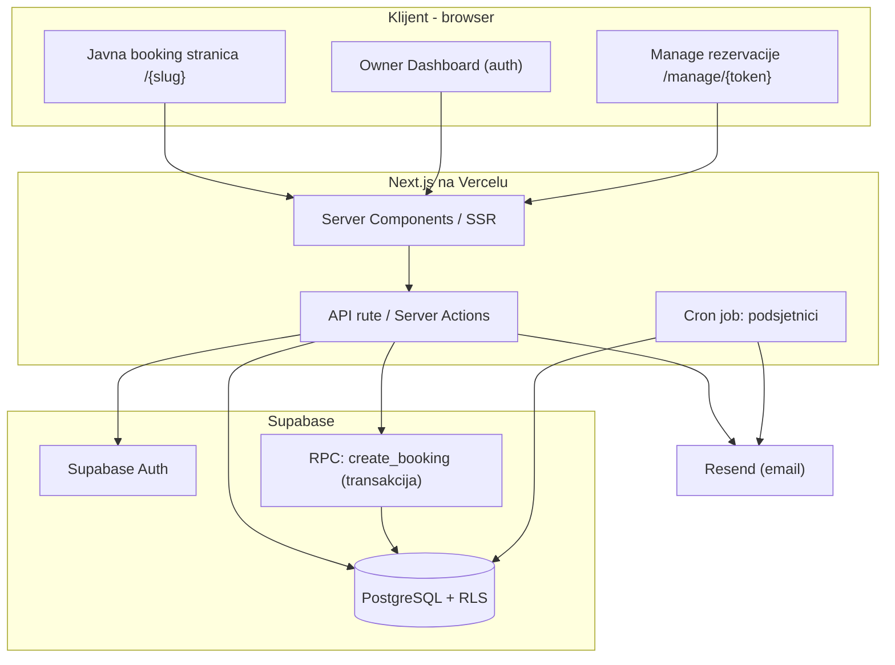
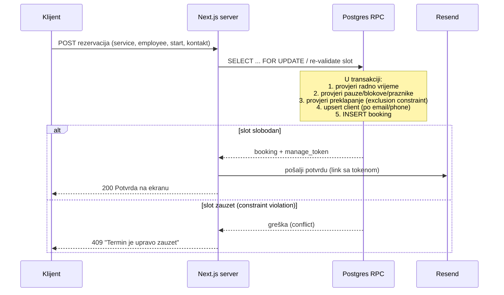

# Slotify — Tehnička arhitektura i implementacija (Tech.md)

> Verzija: 1.0 (MVP)
> Prati: `PRD.md`, `DB.md`

---

## 1. Tehnološki stack

| Sloj | Tehnologija | Razlog |
|------|-------------|--------|
| Frontend / Fullstack | **Next.js (App Router, React, TypeScript)** | SSR za javne booking stranice (SEO + brzina), API rute, jedan deploy |
| UI | **shadcn/ui + Tailwind CSS** | Brz, dosljedan, pristupačan UI; mobilno-prvo |
| Baza + Auth + API | **Supabase (PostgreSQL, Supabase Auth, PostgREST)** | Postgres + ugrađeni Auth + RLS za multi-tenant izolaciju |
| Email | **Resend** | Transakcioni email (potvrde, podsjetnici, sigurni linkovi) |
| Hosting | **Vercel** | Native za Next.js, edge/serverless, jednostavan CI/CD |
| Pozadinski poslovi | **Vercel Cron** (ili Supabase scheduled functions) | Email podsjetnici 24h prije |

### Ključne biblioteke (preporuka)
- `@supabase/supabase-js` i `@supabase/ssr` — klijent + server (cookie sesije).
- `date-fns` + `date-fns-tz` — rad sa vremenom i timezone biznisa.
- `zod` — validacija ulaza (forme + API).
- `react-hook-form` — forme.
- `@tanstack/react-query` (opciono) — keširanje podataka u dashboardu.

---

## 2. Arhitektura na visokom nivou



### Tipovi Supabase klijenata
- **Anon client (browser):** koristi se za javne, RLS-zaštićene upite (npr. čitanje javnih usluga biznisa).
- **Server client (SSR/Server Actions):** vezan na korisničku sesiju vlasnika (cookies) — sve owner operacije idu kroz RLS kao taj korisnik.
- **Service-role client (samo server):** zaobilazi RLS, koristi se ISKLJUČIVO za kontrolisane operacije gdje gost nema sesiju (npr. kreiranje rezervacije od gosta, slanje podsjetnika). Nikad se ne izlaže klijentu.

---

## 3. Multi-tenancy model

- Single-database, single-schema, **tenant po koloni `business_id`** na svim resursima.
- Izolacija se NE oslanja na aplikativni kod nego na **Row Level Security (RLS)** u Postgresu.
- Vlasnik je povezan sa biznisom preko `business.owner_id = auth.uid()` (i/ili `business_members` tabele radi buduće ekspanzije).
- Javni pristup (gost) dozvoljen je samo za read-only "javne" podatke (aktivni biznis, aktivne usluge, dostupnost) i za insert rezervacije kroz kontrolisanu RPC funkciju.

Detaljne RLS politike: vidi `DB.md`.

---

## 4. Rutiranje (Next.js App Router)

```
app/
  (public)/
    [slug]/page.tsx              # Javna booking stranica biznisa
    [slug]/book/...              # Korak-po-korak booking flow
    manage/[token]/page.tsx      # Upravljanje rezervacijom preko sigurnog linka
  (auth)/
    login/page.tsx
    register/page.tsx
  (dashboard)/
    dashboard/page.tsx           # Pregled (danas + sedmica)
    calendar/page.tsx            # Kalendar dan/sedmica + lista
    services/page.tsx
    employees/page.tsx
    schedule/page.tsx            # Radno vrijeme, pauze, blokovi, praznici
    clients/page.tsx
    settings/page.tsx            # Politike biznisa, branding
  api/
    bookings/route.ts            # (alt. Server Actions)
    cron/reminders/route.ts      # Vercel Cron endpoint
```

- Javne stranice su **Server Components** (brz first paint, dobar SEO).
- Owner dashboard je iza autentifikacije (middleware provjerava sesiju).
- Mutacije preferentno kroz **Server Actions** ili API rute uz `zod` validaciju.

---

## 5. Autentifikacija i autorizacija

### 5.1 Vlasnik
- **Supabase Auth, email + lozinka.**
- Sesija se čuva u httpOnly cookie-jima preko `@supabase/ssr`.
- `middleware.ts` štiti `(dashboard)` rute i preusmjerava neautentifikovane na `/login`.
- Pri registraciji se kreira `auth.users` zapis; trigger/kod kreira `business` (ili se kreira u setup wizardu).

### 5.2 Klijent (gost)
- Nema nalog.
- Identifikuje se i upravlja rezervacijom isključivo preko **neprozirnog tokena** (`booking.manage_token`) u URL-u `/manage/{token}`.
- Token je nasumičan, dovoljno dug (npr. 32+ bajta, base64url), jedinstven po rezervaciji.

### 5.3 Autorizacija (RLS sažetak)
- Owner vidi/mijenja samo redove gdje `business_id` pripada njegovom biznisu.
- Gost: read javnih resursa + insert rezervacije kroz RPC; čitanje pojedinačne rezervacije samo preko tokena (server-side provjera).

---

## 6. Booking logika (kreiranje rezervacije)

Kreiranje je **transakciono** i ide kroz Postgres RPC funkciju `create_booking(...)` pozvanu sa servera (service-role za goste):



### Garancija protiv duplih rezervacija
- Primarna zaštita: **Postgres exclusion constraint** nad `(employee_id, [time_range])` za aktivne statuse (`btree_gist`).
- Aplikativna provjera dostupnosti je samo UX sloj; konačnu riječ ima DB ograničenje.
- Detalji constrainta: `DB.md`.

---

## 7. Sistem dostupnosti (Availability engine)

Cilj: za dati `(business, employee, service, datum)` vratiti listu slobodnih početnih slotova.

### Ulazi
1. Radno vrijeme zaposlenog za taj dan (override) ili default biznisa.
2. Trajanje usluge za tu kombinaciju zaposleni × usluga (+ buffer usluge).
3. Pauze zaposlenog.
4. Blokirani periodi i neradni dani (biznis i zaposleni).
5. Postojeće aktivne rezervacije (`pending`, `confirmed`).
6. Lead time pravila biznisa (min. najava, max. horizont).
7. Timezone biznisa (svi izračuni u toj zoni).

### Algoritam (pseudokod)
```
def free_slots(business, employee, service, date):
    tz = business.timezone
    windows = working_windows(employee, date)        # nakon nasljeđivanja od biznisa
    windows -= breaks(employee, date)
    windows -= blocks_and_holidays(business, employee, date)

    duration = service_duration(employee, service) + service_buffer(service)
    busy = active_bookings(employee, date)           # intervali zauzetosti

    slots = []
    for w in windows:
        t = align_to_grid(w.start, 15min)
        while t + duration <= w.end:
            interval = (t, t + duration)
            if not overlaps(interval, busy) and within_lead_time(t, business):
                slots.append(t)
            t += 15min
    return slots
```

- Izračun se radi **server-side** (Server Component / API), nikad se ne vjeruje klijentu.
- Pri samom upisu rezervacije, dostupnost se **ponovo validira u transakciji** (zaštita od race condition-a između prikaza i potvrde).

---

## 8. Email (Resend)

Transakcioni emailovi:
- **Potvrda rezervacije** (klijentu) — sadrži detalje + siguran link `/manage/{token}`.
- **Obavještenje vlasniku** o novoj rezervaciji (opciono u MVP-u).
- **Izmjena / otkazivanje** — potvrda promjene.
- **Podsjetnik 24h prije** — slat Vercel Cron jobom koji skenira `bookings` za naredni prozor.

Email se šalje isključivo sa servera; API ključ Resenda je server-side env varijabla.

---

## 9. Pozadinski poslovi

- **Vercel Cron** (`app/api/cron/reminders/route.ts`) pokreće se periodično (npr. svakih sat).
- Pronalazi potvrđene termine kojima je do početka ~24h i nije poslan podsjetnik (`reminder_sent_at IS NULL`), šalje email i obilježava.
- Endpoint zaštićen tajnim headerom (`CRON_SECRET`).

---

## 10. Konfiguracija i okruženje

| Env varijabla | Namjena | Strana |
|---------------|---------|--------|
| `NEXT_PUBLIC_SUPABASE_URL` | Supabase URL | Klijent + server |
| `NEXT_PUBLIC_SUPABASE_ANON_KEY` | Anon ključ (RLS) | Klijent + server |
| `SUPABASE_SERVICE_ROLE_KEY` | Service role (zaobilazi RLS) | **Samo server** |
| `RESEND_API_KEY` | Slanje emaila | Samo server |
| `CRON_SECRET` | Zaštita cron endpointa | Samo server |
| `NEXT_PUBLIC_APP_URL` | Baza za linkove (slug, manage token) | Klijent + server |

---

## 11. Deployment i CI/CD

- Repo na Git-u → **Vercel** auto-deploy (preview po PR-u, production na `main`).
- Supabase: migracije kroz `supabase/migrations` (SQL), primjenjivane preko Supabase CLI / MCP.
- Redoslijed pri promjenama šeme: napiši migraciju → primijeni na staging projekat → test → production.
- Sekreti se drže u Vercel Environment Variables (po okruženju).

---

## 12. Sigurnosna razmatranja

- **RLS uključen na SVIM tenant tabelama** (deny-by-default).
- Service-role ključ nikad ne ide na klijent; koristi se samo u server kontekstu.
- Manage tokeni su nasumični i neprozirni; rate-limit na manage i booking endpointima.
- `zod` validacija svih ulaza; sanitizacija prikaza.
- Rezervacije gosta čitaju se samo uz validan token (server provjera), nikad listanjem.

---

## 13. Strategija testiranja (preporuka)

- **Unit:** availability engine (rubni slučajevi: granice radnog vremena, buffer, lead time, preklapanja).
- **Integracioni:** RPC `create_booking` — konkurentni pozivi na isti slot (mora pasti tačno jedan).
- **RLS test:** korisnik biznisa A ne smije pročitati podatke biznisa B.
- **E2E (opciono):** Playwright za glavni booking tok.
